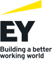

# Sunbird Spark Partners

Our partners build, deploy, and support learning platforms for diverse communities. Together, we extend access to quality learning at scale.

***

<figure><figcaption></figcaption></figure>

#### About EY

EY brings its digital transformation expertise to help public and private organisations build more inclusive, accessible, and equitable education systems. As governments and institutions adopt Sunbird Spark, EY supports them end-to-end — from strategy to deployment to scale.

EY's teams working with Sunbird Spark help organisations:

* Apply Spark's building blocks alongside RPA, AI, and analytics to make digital learning services effective and personal
* Shape citizen-centric, inclusive digital strategies for Spark-based programmes
* Architect the technology for Spark deployments and manage development environments
* Use data and analytics on Spark deployments to understand user needs and manage risk
* Redesign organisational structure, roles, and processes to adopt Spark effectively
* Build tools and solutions that improve the return on investment of Spark deployments

#### Contact

Contact details to be added.

***

<figure><figcaption></figcaption></figure>

#### About Sanketika

Sanketika Consulting Private Limited is a Bangalore-based engineering firm specialising in Digital Public Infrastructure (DPI), Digital Public Goods, AI systems, and data engineering.

As a principal architect and core contributor to the Sunbird ecosystem, Sanketika now applies that depth to Sunbird Spark. Sanketika can:

* Conceptualise, extend, and implement Spark's building blocks for adopting organisations — from initial architecture through to production deployment
* Contextualise Spark for governments outside India — DPI implementations in Cambodia and the Dominican Republic, and a Sunbird-based platform in Morocco
* Integrate Spark with identity, credentialing, and registry systems — including Sunbird RC for verifiable credentials — applying India Stack knowledge
* Design Spark deployments for interoperability and open standards, with open protocol contributions informing API standardisation and registry management

#### Contact

#### **Email Id:** [connect@sanketika.in](mailto:connect@sanketika.in)

***

<figure><figcaption></figcaption></figure>

#### About Tekdi Technologies

Tekdi Technologies is a Pune-based open-source engineering firm that has worked across the Sunbird ecosystem for years, and now brings that expertise to Sunbird Spark. Tekdi can:

* Install, configure, and customise Sunbird Spark building blocks — either owning delivery end-to-end or augmenting your engineering team with Spark expertise
* Offer Spark as a hosted SaaS for nonprofits, civil society organisations, and governments, enabling faster rollout and pay-as-you-scale pricing
* Deliver Spark as a flexible PaaS, combining a scale-tested backend with the customisation needed for specific use cases and audiences
* Provide tech consulting so Spark deployments are scalable, compliant, and aligned with NDEAR and Digital Public Goods principles — including integrating AI solutions such as AI4Bharat and Bhashini APIs

#### Contact

Contact details to be added.

***

### Partner with us

Interested in collaborating on Sunbird Spark? [Contact the community](https://github.com/project-sunbird).
