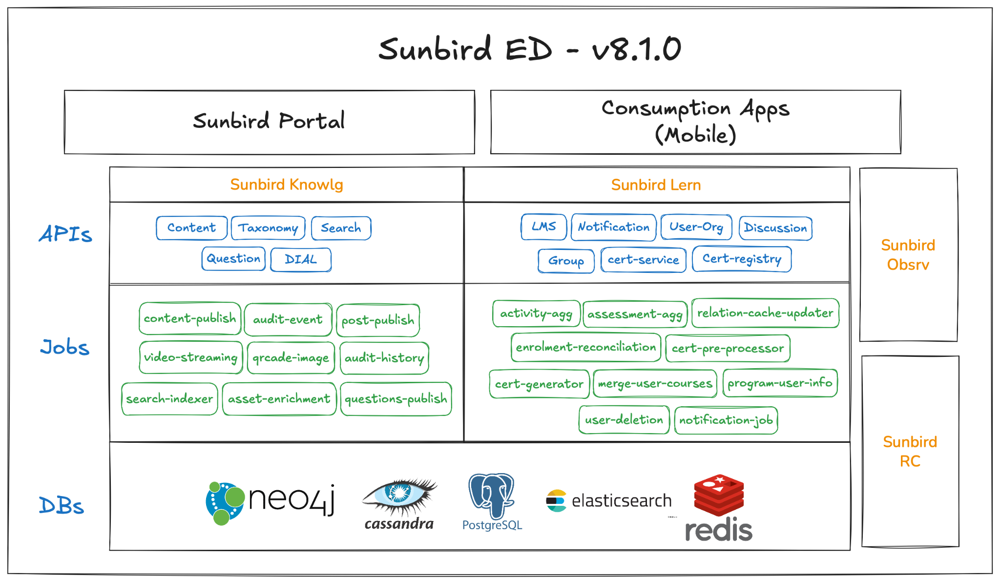

# Architecture Overview

Sunbird Spark is a re-architecture of Sunbird ED, designed to reduce infrastructure cost and operational complexity while preserving full backward compatibility. This page explains how the platform is structured and why the key architectural decisions were made.

### Why Spark was re-architected

Sunbird ED was built to support national-scale deployments, which meant the default installation included the full capability set regardless of what a given adopter actually needed. This created three concrete problems:

**High infrastructure footprint.** A minimal ED deployment ran 20+ independent microservices and assumed a baseline of \~10,000 concurrent users, even for small or early-stage adopters.

**Outdated dependencies.** Key components — Node.js, Kafka, NodeBB — had fallen behind current versions, increasing exposure to known security vulnerabilities.

**DIKSHA-specific UI.** The portal and mobile apps were built around DIKSHA's workflows, making them hard to adapt for organisations with different requirements.

Spark addresses all three: services are consolidated, dependencies are current, DIKSHA-specific features are optional add-ons, and the frontend has been rebuilt for flexibility and ease of customisation.

### Before and after



<figure><figcaption></figcaption></figure>

**Fewer than 5 services · 1 database cluster (YugabyteDB) · Add-on architecture**



**20+ microservices · 3 transactional databases · All features on by default**

<figure><figcaption></figcaption></figure>




### Service consolidation

Sunbird ED ran 20+ independent API microservices. Spark consolidates these into fewer than 5 services at deployment time, with no change to the external API surface.

| Sunbird ED services                                                     | Sunbird Spark service                   |
| ----------------------------------------------------------------------- | --------------------------------------- |
| taxonomy-service + content-service + knowlg-mw-service + search-service | **knowlg-service**                      |
| inQuiry Assessment Service                                              | Merged into **knowlg-service**          |
| userorg-service + lms-service + notification-service                    | **lern-service**                        |
| cert-service                                                            | **cert-service** (retained separately)  |
| cert-registry                                                           | **cert-registry** (retained separately) |

The consolidation is done at the **packaging and deployment level only** — the source code for each service remains in its own repository and can still be deployed independently if an adopter requires it. For the vast majority of deployments, the merged services reduce Kubernetes pod count, simplify CI/CD, and cut per-service operational overhead.

**All existing API endpoints are preserved.** Client applications — mobile apps, third-party integrations, custom portals — do not need any changes.

### Database consolidation

Sunbird ED used three separate transactional databases, each serving a different purpose. Spark consolidates these into a single database cluster.

| Sunbird ED database                      | Sunbird Spark replacement                     | Why                                                                                                                              |
| ---------------------------------------- | --------------------------------------------- | -------------------------------------------------------------------------------------------------------------------------------- |
| **Cassandra** (user and course data)     | **YugabyteDB** (YCQL — CQL-compatible)        | Yugabyte supports the Cassandra Query Language driver, so existing CQL-based services work without code changes.                 |
| **PostgreSQL** (Keycloak, RC, form data) | **YugabyteDB** (YSQL — PostgreSQL-compatible) | Yugabyte supports the PostgreSQL driver, so existing PSQL-based services work without code changes.                              |
| **Neo4j** (content metadata graph)       | **JanusGraph** (backed by YugabyteDB storage) | Eliminates Neo4j as a separate infrastructure dependency while retaining graph query capability for content hierarchy traversal. |

**Redis** is retained as an optional read-through cache but is **disabled by default**. Adopters can enable it when their deployment scale requires it.

This consolidation means a production Spark deployment needs one database cluster (YugabyteDB) instead of three, significantly reducing infrastructure cost and operational complexity.

> ⚠️ A data migration script is provided to migrate existing data from Postgres, Cassandra, and Neo4j to YugabyteDB. **This migration is non-reversible.** See the ED → Spark Migration Guide for the full migration approach.

### Frontend technology choices

#### Web portal — React

The Spark web portal is rebuilt in **React with structured conventions**. The previous Angular portal was stable at scale but had a steep learning curve, complex codebase, heavy bundle sizes, and limited support for AI-assisted UI development — all of which slowed customisation for adopter teams.

React was chosen over Next.js and Angular for the following reasons:

* **Lower infrastructure cost than Next.js:** Next.js's default SSR behaviour increases server running cost by 2–3x. React as a client-side SPA keeps server costs low while meeting Spark's performance requirements.
* **Faster onboarding than Angular:** Most adopter teams already have React skills; Angular's learning curve (RxJS, decorators, strict module system) was a recurring adoption barrier.
* **Strong AI-assisted development support:** React works well with agentic UI generation tools, enabling faster customisation and feature rollout for adopter teams.
* **Preserves existing investments:** The rewrite maintains full compatibility with existing web component-based content editors and players, Node.js backend services, and established telemetry instrumentation.

The portal supports **multi-theme configuration** — logo, colours, and layout — at the channel (tenant) level. AI-assisted tooling can be used to generate and maintain themes.

For the full technology comparison and decision rationale, see the [Frontend Technology Decision document →](https://docs.google.com/document/d/12rxghwa1eXORThCByzrR1ZXTE0FnQ7Cx_yhB4OA6oTU/edit).

#### Mobile app — Ionic + React

The Spark mobile app is built on **Ionic + React**. The primary factors driving this choice over React Native and Flutter:

* **Sunbird content players are HTML/JS-based** — they integrate naturally within Ionic's WebView, with no additional bridging layers required. React Native and Flutter both require additional integration work for WebView-based players.
* **Code reuse with the web portal** — sharing React components, business logic, and UI patterns between the portal and mobile app reduces cost and maintenance overhead.
* **Low disruption for adopter teams** — existing teams and adaptor organisations work with web technologies. Ionic + React minimises the reskilling required.
* **Low migration risk** — incremental evolution is possible from the existing Ionic/Capacitor codebase. React Native would require a significant parallel rewrite; Flutter would require a full rewrite in Dart.

**Android minimum SDK: 28 (Android 9.0)**, covering 93%+ of active Android devices.
